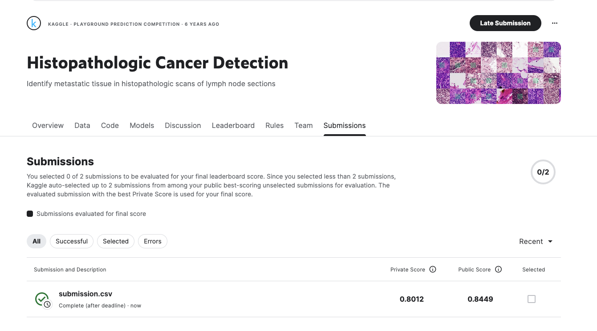

---

# Histopathologic Cancer Detection – CNN Mini-Project

**MSc Computer Science & AI – Deep Learning Peer-Graded Assignment**
Author: Fatih Uenal
Date: June 2025

---

## Overview

This project addresses the **Histopathologic Cancer Detection** task on Kaggle, in which the goal is to classify small digital pathology images as cancerous or non-cancerous using Convolutional Neural Networks (CNNs). The solution is designed for the MSc Computer Science & AI course, and the workflow, code, and findings are organized in a clear, reproducible manner.

---

## Project Organization

The analysis is implemented in a Jupyter notebook, structured into the following major sections:

1. **Introduction & Problem Statement**

   * Brief overview of the biomedical challenge
   * Dataset origin and classification task
  
2. **Problem and Data Overview**
3. **Data Loading & Preprocessing**

   * Efficient reading of image files and labels
   * Data normalization and preparation for modeling

4. **Exploratory Data Analysis (EDA)**

   * Visualization of label balance
   * Sample image display and observations
   * Noting potential issues and modeling implications

6. **Train/Validation Split**

   * Stratified split to maintain label balance
   * Preparation for robust model evaluation

7. **Model Architectures**

   * Custom Convolutional Neural Network (CNN)
   * Transfer Learning with MobileNetV2
   * Model selection rationale and key hyperparameters

8. **Model Training & Evaluation**

   * Training both models on full and reduced datasets
   * Performance tracking via accuracy and loss curves
   * Use of early stopping, learning rate scheduling, and augmentation

9. **Results & Analysis**

   * Comparison of training and validation performance
   * ROC AUC, confusion matrix, and sample prediction visualizations
   * Brief discussion of findings

10. **Kaggle Submission**

   * Generating predictions for the test set
   * Outputting a submission file ready for Kaggle evaluation

11. **Discussion & Conclusion**

   * Main insights, strengths, and limitations
   * Suggestions for further improvements

---

## Dataset

* **Source:** [Kaggle: Histopathologic Cancer Detection](https://www.kaggle.com/c/histopathologic-cancer-detection)
* **Contents:**

  * High-resolution (96x96 RGB) image patches from lymph node tissue
  * `train_labels.csv`: Image IDs and binary labels (1: cancer, 0: no cancer)
  * Test images for final evaluation

---

## Results

* **Model Performance:**

  * Both a custom CNN and MobileNetV2 were trained and evaluated.
  * Final validation accuracy and ROC-AUC metrics are provided in the notebook.
* **Kaggle Submission:**

  * The notebook produces a `submission.csv` file in the required format for leaderboard evaluation.

## Kaggle Submission & Score

Below is the screenshot of my model’s position on the Kaggle leaderboard:



---

## Usage

1. Clone this repository and download the competition dataset from Kaggle.
2. Run the Jupyter notebook step-by-step to reproduce the analysis and results.
3. Submit `submission.csv` to the Kaggle competition for scoring.

---

## Example Submission File

```csv
id,label
abc123,0
def456,1
ghi789,0
```

---

## Acknowledgments

* Kaggle and the organizers for providing a rich, real-world dataset.
* The MSc Computer Science & AI program for framing this as a hands-on assignment.

---

